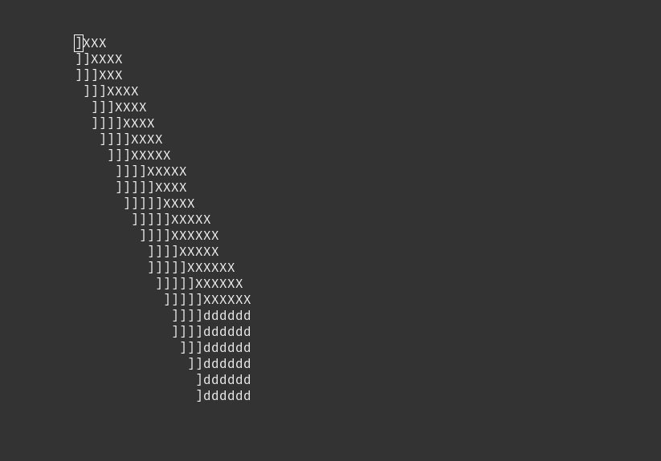

# EbicRenderer
It's a simple ascii renderer using ncurses.Just a jumping off point for a better renderer.

## ToDos
- [ ] Add a better camera system
- [ ] Add a better .obj parser (this one is just a proof of concept)