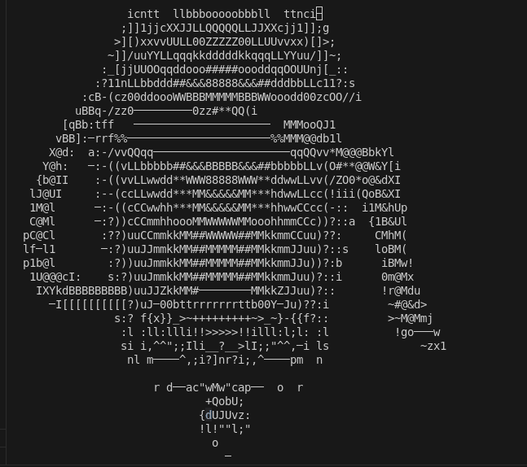

# EbicRenderer
It's a simple ascii renderer.My first C project.

## ToDos
- [ ] Add a better camera system
- [x] Add a better .obj parser (this one is just a proof of concept)
-[ ] Need to work on ordering of faces in z direction (currently it's just a hack)